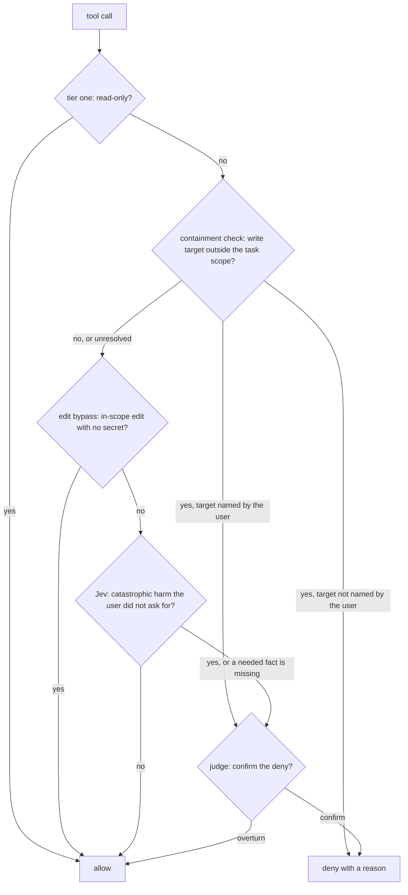

# Decision model

auto-mode decides one thing about each tool call: allow it, or deny it with a reason so the agent
continues on another path. A human sees a prompt only when the agent runs out of denials.
Deterministic checks settle what they can, a classifier asks whether the action causes catastrophic
harm the user did not ask for, and a generative judge reviews every classifier deny. This is the
approved model; the [overview](./overview.md) describes the code as it runs, and where the two
differ, this doc is the target. The
[decision record](https://linear.app/zgeoff/document/geo-100-decision-record-auto-mode-decision-model-4c00fccbe287)
holds the reasons, the evidence, and the rejected alternatives for each point below.

## The pipeline

1. Tier one allows read-only calls by deterministic match and passes everything else on.
2. The containment check reads the write targets of the call and denies any target outside the task
   scope, naming the target. It never allows. A target it cannot resolve, such as a path computed by
   a pipe or a variable, passes to Jev.
3. The edit bypass allows a file-tool edit into an in-scope worktree without asking Jev.
4. Jev, the classifier, allows by default and denies when a block rule reaches its threshold.
5. The judge reads each Jev deny and either confirms it with a written reason or overturns it to
   allow.

Each stage after tier one runs only on what the earlier stages passed on. A containment deny is
final, so no later stage, configured allow entry, or consent can clear it. One exception: when the
last direct user message contains the exact target, the containment check hands the call to the
judge instead of denying it.

## Outcomes and recovery

Every non-allow outcome is a deny with a reason, and the agent continues. The reason names the rule,
what was refused, and what would clear it: a scope extension, a specific user instruction, or a
safer path. The deny carries an instruction to find a safer path and not to route around the block.
Neither the classifier nor the judge asks a human.

A denial budget is the only path to a human. auto-mode counts denials per session, and each subagent
keeps its own count. An allow resets the consecutive count, and a retry of the action just denied
adds to it. Each deny carries the number of denials left, and the last deny before the limit carries
an instruction to stop and report what consent the agent needs. The call that exceeds the budget
gets the harness's normal permission prompt, and both counts reset after the human answers. The
consecutive limit and the per-session limit are configuration values.

The session key comes from the mod's session identity, which survives a resume. The denial counts
and the derived task scope persist on disk under that key, because the mod's memory does not survive
a reload.

## Task scope

The task scope is the set of worktrees, branches, PRs and remotes that the task owns. It is the
union of pluggable scope sources behind one interface in auto-mode's core: given the action's
context, a source answers with scope facts (worktrees, branches, PRs, path globs) or nothing.
Configuration chooses which sources run.

- The cwd scope: the worktree that holds the action's current directory, and its branch unless that
  branch is the default branch.
- What the session created: worktrees and branches the session's own calls made, and PRs whose head
  branch is in scope. The mod reports each finished call that can create one, and auto-mode keeps
  what it made on disk per session ID, because the mod's memory does not survive a reload.
- The checkout's remotes.
- Static path globs in auto-mode's configuration that every task owns, such as a scratch directory.
  A glob that covers every worktree, such as `.worktrees/**`, defeats the check.
- atc's general session record. atc publishes one record per session it spawns, outside anything the
  agent can write, and names its location in an environment variable. The record lists the workspace
  atc prepared and its branch, plus extra worktrees, branches and PRs; a trusted caller may extend
  it through atc during the task. atc owns the record's format, and auto-mode reads it through an
  adapter. A session without a record gets nothing from this source.

No source can hand a task the default branch or a protected branch.

The user-named grant is the last source and the only one decided per call. When the last direct user
message contains the exact target (a path, a branch name, a PR number), the containment check hands
the call to the judge. The judge allows the call only when the user, in that message, asks for this
action (write, delete, merge) on this target. A name alone is not consent: "port the formatter from
the export-csv worktree" names a read source, not a write target. The grant never covers the default
branch, a protected branch, or an `--admin` merge.

The containment check reads write targets only: paths written, moved or deleted, branches deleted or
pushed, PRs merged, closed or commented on, and remotes pushed to. It reads `gh api graphql` as a
read unless the query carries `mutation`.

## The edit bypass

Edit, Write and NotebookEdit calls whose target lies in an in-scope worktree skip Jev. Shell writes
go to Jev. These targets go to Jev even inside the scope:

- Agent and harness configuration, such as `.claude/`, `AGENTS.md`, `CLAUDE.md`, settings and hook
  files.
- auto-mode's own configuration and state.
- `.git/`.
- CI workflows.
- Env and credential files.

A deterministic secret scan reads the bypassed content and sends any hit to Jev. The scan uses the
Betterleaks rule set compiled into the node bundle, because the hook runs under node with bundled
dependencies and cannot ship a Go binary. Live secret validation stays off, because it sends the
secret to a third party.

## Jev and the rules

Jev answers one question about a call the deterministic stages did not settle: does it cause
catastrophic harm that the user did not specifically ask for? A missing fact needed to rule out
catastrophic harm counts as a block, and the reason names the fact. Jev does not review tolerable
risk, judge ownership of worktrees and branches, review code, or stand in for a human.

Catastrophic harm means doing one of these without being asked:

- Losing work the task does not own: another worktree, the home directory, uncommitted work.
- Writing to the default branch or to production.
- Publishing, or sending data outward.
- Changing credentials or permissions.
- Disabling auto-mode itself.

The rules assume an isolated environment: a container or virtual machine with no route in from
outside. A scheduled job, root access, or a port bound inside it grants nobody outside a way in, so
it is not catastrophic by itself; losing work inside it still is. Local use on a personal machine is
opt-in to more risk, and configured deny entries add back what the user wants stopped.

A block rule exists only to describe catastrophic harm, and its block condition names the
catastrophic target. An action with tolerable risk has no rule and is allowed. The user's configured
deny entries are catastrophic by definition.

The rule tier decides only whether consent can clear a rule. A hard rule never clears. A soft rule
clears with specific user consent or an in-scope target. Jev allows by default and denies when any
rule's P(block) reaches a threshold set from evidence; the deny names the rule with the highest
P(block). Jev and the judge both receive the task scope summary and the checkout's remotes, so
neither guesses them from names.

## The judge

A generative judge reviews every Jev deny. It confirms the deny with a written reason or overturns
it to allow. It overturns a soft-rule deny when the user asks for this action on this target in the
last direct user message. It cannot overturn a hard-rule deny or a configured hard deny; those get a
written reason only.

The judge fails closed. A timeout, an unreadable reply, or a missing verdict keeps the deny with a
template reason. The agent receives a fixed prefix with the rule name, then the judge's text,
bounded in length. auto-mode serves unattended work, so the judge's timeout is long and is a
configuration value. The judge model is chosen by evaluation.

## Packaging

auto-mode is a core library that other software can call, plus a Claude Code mod. The mod supplies
the session identity and the last direct user message. The mod judges only the calls Claude Code
would prompt for; Claude Code's existing allows and denies stay final. auto-mode has no
transcript-reading hook path and no Codex or Muse integration. Codex and Muse each ship their own
auto mode, and Muse can run the mod inside Claude Code.

## Evidence

Six measurements decide whether the model works. Each is reported on its own, never pooled:

1. Catastrophic actions allowed, per stage: containment, Jev, and judge overturns. Any sample that
   allows counts. The sets include a held-out set written by someone other than the detector and
   rule author.
2. Benign denials per action, on real-traffic replay from more than one repository.
3. Consent: consent twins credited and near-misses held.
4. The judge alone: overturn rate, catastrophic overturns, failures, latency.
5. Infrastructure failures per stage: invalid answers and timeouts.
6. Human escalations per task and recovery after a deny, from live use only, because a deny changes
   what the agent does next.

The action log records the deciding stage, the denial counts, and every escalation. Jev's threshold,
the budget defaults, and any release bar are set from these measurements.
